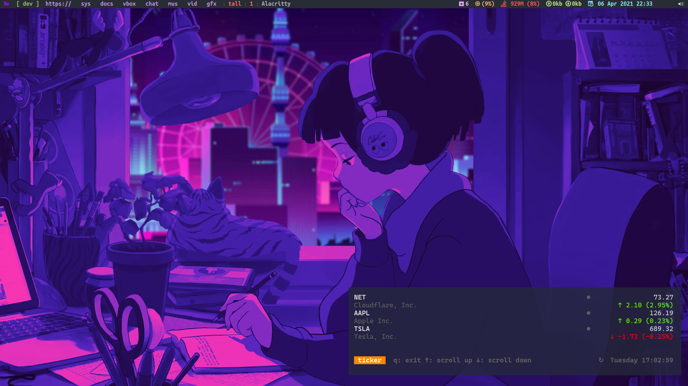
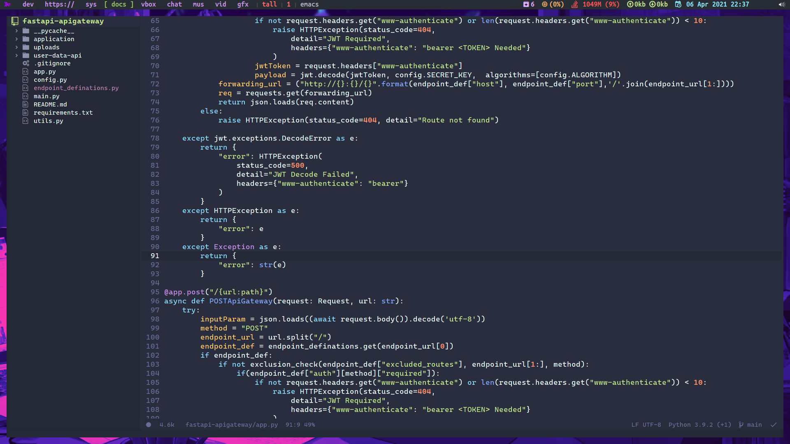
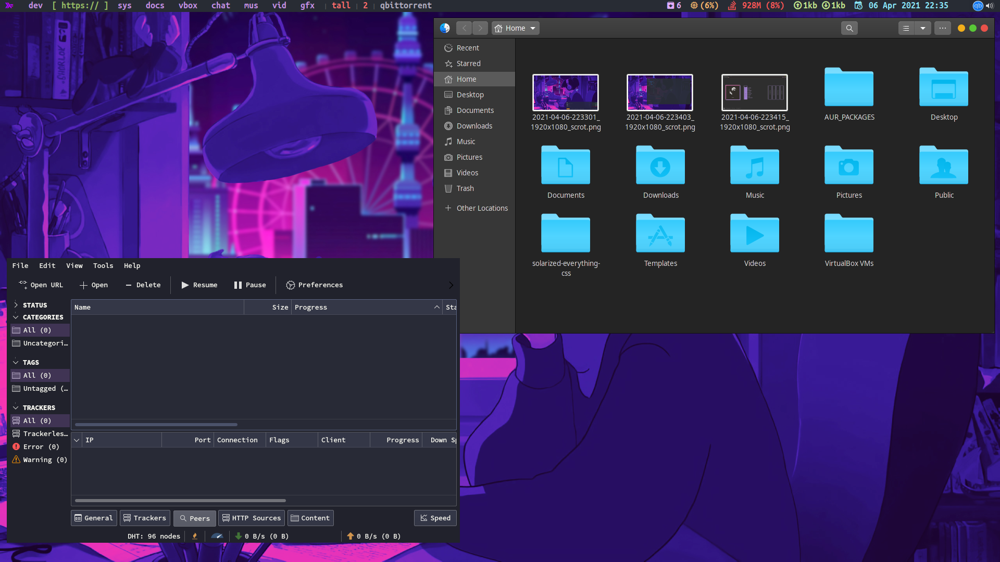
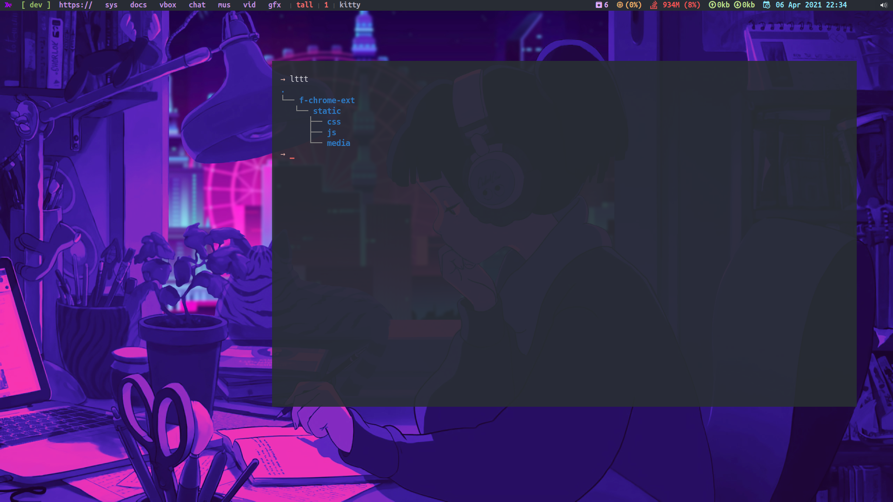
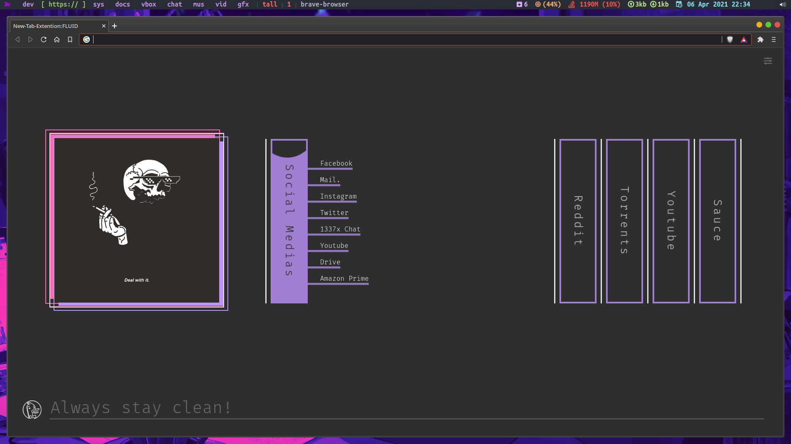
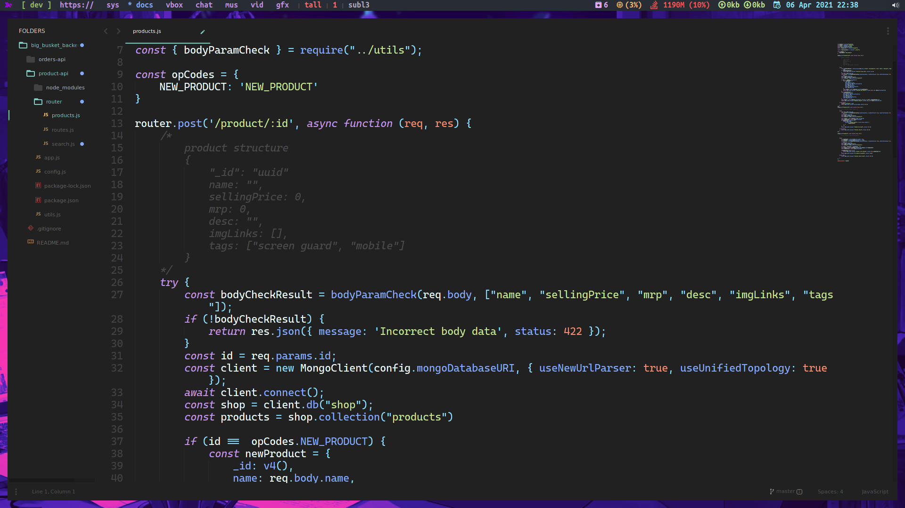

# dotfiles
my dot files
BTW PICOM IS SHIT, ALL FORKS OF IT, pure shit.

pip install ueberzug | needed for image preview in alacritty.
# Qtile

# Nvim

# rofi_1

# rofi_2

# xmonad

# doom emacs

# file explorer

# kitty

# new tab

# sublime3 

